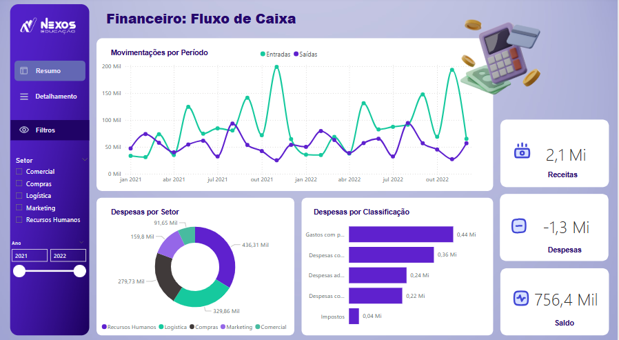

# 📊 Dashboard de Fluxo de Caixa com Power BI

Este projeto apresenta um dashboard interativo de fluxo de caixa construído no Power BI, com base em planilhas do Excel. O objetivo é acompanhar a entrada e saída de recursos ao longo do tempo e oferecer uma visão clara da saúde financeira do negócio.

## 🚀 Funcionalidades
- Visualização mensal e acumulada de receitas e despesas
- Classificação por categoria (fixas, variáveis)
- Saldos iniciais e finais por período
- Indicadores de liquidez e análise de variação

## 🛠️ Ferramentas e Tecnologias
- Power BI (modelagem e visualização)
- Excel (base de dados)
- DAX (cálculos e medidas personalizadas)

## 📁 Estrutura
- `DASHBOARD FLUXO DE CAIXA.pbix` – Arquivo principal com o dashboard
- `dados` – Base de dados simulada
- `PlanodeFundo.svg` – Imagem do dashboard

## 📷 Visual do Projeto

## 👩‍💻 Sobre mim
Desenvolvido por Karen Vitória – Graduada em Análise e Desenvolvimento de Sistemas, com foco em análise de dados, automação e visualização.

📧 karenvitoria90@gmail.com | [[LinkedIn](https://www.linkedin.com/in/karen-vitória-a20742251/)
